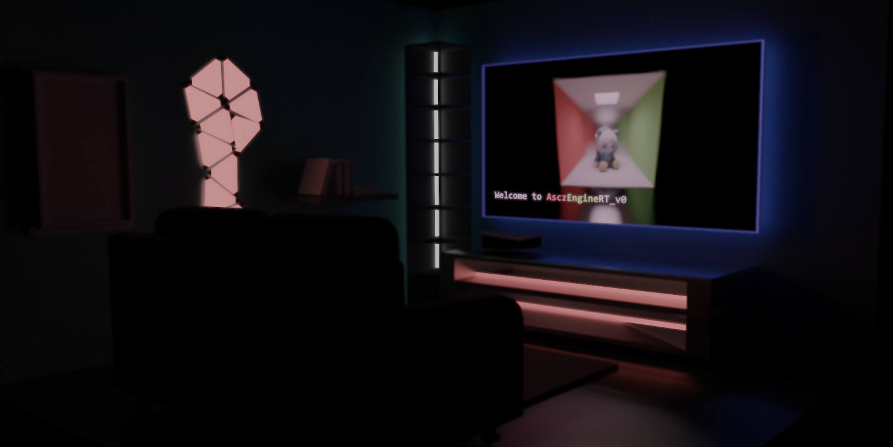
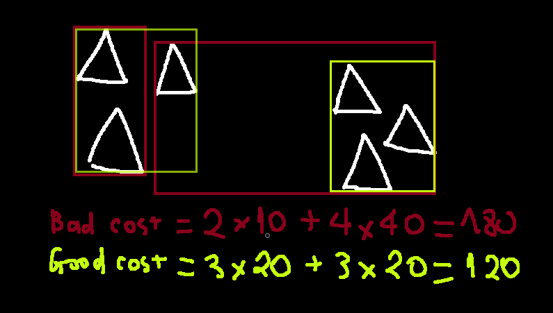
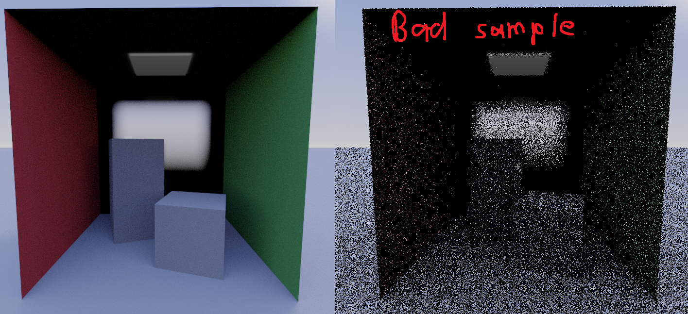

# AsczEngineRT_v0: A pretty cool PBR engine

**AsczEngineRT_v0** is a personal project that tries to make me a graphic programmer without any knowledge regarding graphic libraries/apis or graphic engines.

**AsczEngineRT_v0** is built from scratch in C++ and uses only CUDA for parallel processing. Since you're here anyway, I suppose you can learn a thing or two on how and/or how not to create an engine. Suggestions are appreciated my fellow fanum taxers.

**AsczEngineRT_v0** is **FAR** from perfect, and that's great since that means there's room for improvement. The engine is built with the intention of learning and experimenting with rendering techniques, so if you're looking for a production-ready engine, you're in the wrong place. But if you're looking to learn and experiment with rendering techniques, gracias amigo, enjoy the show.

Is this a school project? Yesn't.

Sorry for the bloated `assets/` folder, I'm too lazy to clean it up.
¯\\_(ツ)_/¯

  <small><i>"Enjoy your stay."</i></small>

###### Run *`cmake .. -G "Visual Studio 17 2022" -T host=x64`* inside of the `build/` folder to generate the project files.

## Requirements

- **CUDA Toolkit**: `11.0` or higher.
- **Visual Studio**: `2017` or higher.
- A solid NVIDIA GPU.

## Introduction to Ray Tracing - Path Tracing

### 1. Ray tracing 101

- The idea behind ray tracing is simple: **you trace ray**.

- But instead of tracing pretty-much-infinite-number of rays from ***light*** $\rightarrow$ ***surface*** $\rightarrow$ ***camera*** (like how light would irl), you trace a finite number of ray from the ***camera*** $\rightarrow$ ***surface*** $\rightarrow$ ***light*** and do the math in reverse. This may seems counter-intuitive, but the performace gain is GYATTDAMN massive since by logic, an infinite number of rays from the light doesn't even reach the camera in the first place.
  - **TLDR: infinite light rays, but finite camera rays, so trace camera rays instead.**

- Ray tracing aim to simulate the behavior of light irl, which allows for a handful of effects like:
  - **Reflection**: light bounces off a surface.
  - **Refraction**: light goes through a surface.
  - **Shading**: light intensity based on the angle of the surface.
  - **Global Illumination** (the source of my nightmares):
    - **Direct Lighting**: light directly from the source (how hard shadow are made).
    - **Indirect Lighting**: light bounces off a surface and hits another surface (how surface are lit up despite not being under direct light).

- Most of which are near impossible to achieve with rasterization without serious hacks and/or workarounds.

#### A. **Recursive Ray Tracing**

- The idea is the result of the next ray will influence the result of the current ray, so you trace the next ray and the next ray and the next ray... until you reach the end, or the limit of the recursion.
- This method is intuitve and simple to implement, but un-shader-friendly, and stack overflow is a b*tch, so it's not recommended.

#### B. **Weight-Based Stack Ray Tracing**

- This method is similar to Monte Carlo's path tracing, but deterministic instead of stochastic.
- To implement this, we'll use a stack to store the ray. Each ray has a weight, the next ray will influence the weight of the current ray, but the total weight of every ray will always be the same (`sum = 1`).
  - Example: 
    - Primary ray `weight = 1.0` $\rightarrow$ Hit a red surface with a `reflective = 0.5` $\rightarrow$ Primary ray `weight = 1.0 * 0.5 = 0.5` + New ray 1 `weight = 1.0 * 0.5 = 0.5`.
    - New ray 1 hit a blue surface with a `reflective = 0.4` $\rightarrow$ New ray 1 `weight = 0.5 * 0.6 = 0.3` + New ray 2 `weight = 0.5 * 0.4 = 0.2`.
    - New ray 2 hit a solid green surface.
    - --- 
    - $\Rightarrow$ **`Result Color`** `=` **`Red * 0.5`** *`(from primary ray)`* `+` **`Blue * 0.3`** *`(from new ray 1)`* `+` **`Green * 0.2`** *`(from new ray 2)`* `=` **`Something idk do the math yourself`**.
    - $\Rightarrow$ **`Result Weight`** `=` `0.5 + 0.3 + 0.2` `=` **`1.0`**.

#### Ray tracing is beautiful (debatable)

- Even without advanced techniques like path tracing, ray tracing can produce some graphically pleasing images already (debatable) thanks to its ability to simulate light behavior in a more realistic way.

  <small><i>A living room with candles lighting up the scene.</i></small>

  <small><i>Apples with shadings.</i></small>

### 2. Optimization 101

- Now that you have a basic understanding of how ray tracing works, let's talk about how to make it **faster**. There's this little thing called **BVH (Bounding Volume Hierarchy)**, basically: *"If I don't see the box, I don't see anything in the box."*

- **BVH** allows you to **skip** a large portion of the scene that you don't need to check. This is done by dividing the scene into smaller boxes, and then dividing those boxes into even smaller boxes, and so on, until you reach what seems to be the most optimal box size.

- Here comes the tricky part, **"where do I slice the cake?"**. Blindly splitting boxes can be **detrimental**, not only because an **unoptimized BVH** negates the effect of spatial partitioning, but also because the depth traversal can become a **bottleneck**, leading to worse performance than just looping through everything.

- This is where **Surface Area Heuristic (SAH)** comes in. **SAH** is a method to determine the optimal split point of a box by calculating the cost of splitting the box at every possible point and choosing the one with the **lowest cost**.

  - The cost formula is:  
  $C_{split} = C_{trav} + \frac{A_{left}}{A_{box}}C_{left} + \frac{A_{right}}{A_{box}}C_{right}$
  - Where:
    - **$C_{split}$** is the cost of splitting the box.
    - **$C_{trav}$** is the cost of traversing the box.
    - **$A_{box}$** is the area of the current box.
    - **$A_{left/right}$** is the area of the left/right box.
    - **$C_{left/right}$** is the cost of traversing the left/right box.
  - Breakdown:
    - Split box into 2 (do this multiple times)
    - Find cost of left and right box (cost = triangle count * box surface area)
    - Total cost = cost left + cost right
    - If total cost < current cost, this is a better split point => Update
    - Do this many times until you find the best split point, or until you reach the max depth.

- Now that we have our bounding boxes, what’s next? Well, there are some **"minor" tweaks** that can help **boost performance** by a sizable margin:
  - **Child ordering** and **Early Exit**: Essentially, *"If the left box is closer to the right box, check the left box first"*. If the ray hits something in the left box, there's no need to check the right box, since that hit intersection is closer than any potential intersection in the right box.

- By using all these optimization techniques, the engine is able to render a ultra-complex scene with `~4 million triangles` at `~200fps`, which is kinda mind-blowing considering the fact this engine was initially built for a static renderer.

### 3. Sampling 101

- Heavily used in ray and path tracing, because let’s be real - a single ray won’t cut it.

#### Soft Shadows

- Light sources are usually not a single point, but an area (or a volume). 
- Shadows are not an on/off switch, but more of a grayscale gradient.
- To simulate soft shadows, you need to sample multiple rays from the light source and average the result.

#### Depth of Field

- In the real world, cameras (and our eyes) don’t focus everything perfectly—only objects at a certain focal distance appear sharp, while others blur.
- To simulate this effect, we use a thin-lens model, where the camera lens is not a single point but a small aperture that gathers light from slightly different positions.
- This means we need to randomly sample rays from the lens surface and direct them toward the focal point.

  <small><i>de_dust2.</i></small>

#### Reflectance

- When light hits a surface, it can do a couple of things:
  - It can **bounce off** perfectly like a mirror (aka specular reflection).
  - It can **scatter in random directions** like a rough wall (aka diffuse reflection).
  - It can kinda do **both**, depending on the material (glossy reflection).
- How Do We Sample This?
  - *Diffuse Surfaces*: Use cosine-weighted hemisphere sampling (favor directions near the surface normal).
  - *Glossy Surfaces*: Use importance sampling, biasing rays toward the reflection vector.
  - *Metals and Dielectrics*: Use the Fresnel equations to determine how much is reflected vs. refracted.

- To accurately simulate this, we use a little something called a **Bidirectional Reflectance Distribution Function (BRDF)**, I won't bore you with the details but it's basically a function that tells you how a surface reflects light.

### 4. Path Tracing 101

- This is what most people meant when they say "ray tracing". Path tracing is ray tracing on steriods.

#### First Iteration

- I cast path tracing signature move: **Global Illumination**, or more specifically, **Indirect Lighting**. Irl, light bounces off multiple surfaces while obeying the law of energy conservation, and path tracing tries to simulate that by casting multiple rays per pixel and averaging the result using calculations and stuff.

  <small><i>Cornell Box with Path tracing.</i></small>

  <small><i>Without vs With Path Tracing</i></small>

###### Keep in mind these examples use relatively low sample-per-pixel count, so there are noticable noises and artifacts.

#### Second Iteration

- A good way to implement kinda-real-time-path-tracing is by using **Temporal Accumulation**, with only *`1 sample-per-pixel(spp)`*, which averages the result of the previous frame with the current frame to reduce noise and artifacts as long as the camera doesn't move. This will *introduces alot of noises and artifacts* at first, but significantly *reduce render time*, allowing the frame to converge to a cleaner image over time, as well as providing a more interactive experience (since you can still kinda move the camera around).

  <small><i>Actually correct <b>Global Illumination</b>.</i></small>

  <small><i><b>Direct Lighting only</b> vs <b>Global Illumination</b>.</i></small>

- *Temporal Accumulation* also allows you to reduce the *`spp`* count down to `1` on every path tracing effects (Soft Shadows, Reflectance, Anti-Aliasing, Depth of Field, etc.) to further reduce render time.

#### Third Iteration

**Standard Path Tracing vs. Next Event Estimation (NEE)**
- Ever wondered why some renders look like a randomized TV static party while others actually resemble a scene? That’s the difference between standard path tracing and Next Event Estimation (NEE).

##### A. Standard Path Tracing

- This method plays the lottery with light. It randomly bounces rays around, hoping to hit a light source. The result? A mess of noise, where shadows and lighting are barely recognizable.

  <small><i>Indistinguishable abomination.</i></small>

##### B. NEE Path Tracing

- NEE is smarter—it directly asks the light source for its opinion instead of aimlessly guessing. This makes shadows clearer, lighting more structured, and noise more tolerable.

  <small><i>Orderly structure amidst the noise chaos.</i></small>

##### TL;DR

- Standard Path Tracing: Wild guessing. Random noise. Bad time.
- NEE: Smarter guessing. Visible shadows. Better time.

###### Moral of the story? Don’t gamble with light, ask it directly!

---

## What's Next

### Multiple Importance Sampling (MIS)

#### 1. What we have so far

- **A. Standard path tracing**
  - Relies on *indirect sampling* via *random bounces*:
  - Shoot a ray from camera and accumulate radiance through multiple bounces.
  - Lighting is gathered indirectly.
  - This method *eventually* converges to the correct solution, but:
    - Hard to sample low-probability paths (small light sources).
    - High noise, ughh.
  - ---
- **B. Next Event Estimation (NEE, Importance sampling on light sources.)**:
  - Instead of sampling bounces randomly, sample the light source directly.
    - Sample random light source, and random point on that light source.
    - Calculate the direct lighting contribution.
  - However, it does come at the cost of extra computation (shadow rays), yikes.

#### 2. MIS - The chimera

- Combining both NEE and path tracing to get the best of both worlds.
- **Random bounces (path tracing)** ensure indirect lighting is captured.
- **Next Event Estimation (NEE)** improves efficiency by reducing variance in direct lighting.

## How to Use

- Honestly, I am quite terrible when it comes to interface and stuff, so for the time being just run the `AsczEngine.exe` I guess. You can mess with the `.model` and `.cfg` files to idk, figure things out I guess.

### Credits

- Me (Asciiz) for the engine.
- Youtubers, articles, documentations, and forums for the knowledge (sorry I can't list them all, but thank you).
- `stb_image.h` for image loading.

### Contribute

- Whether you have ideas, suggestions, techniques, or just want to discuss rendering techniques, contributions are welcome.
- Once again, this engine is **far** from perfect, so any help is appreciated.

---

# Ignore

- **BVH**: SAH, stack traversal.
  - **SAH**: cost formula, optimal split point.
  - **Stack Traversal**: child ordering, early exit.
- **Ray tracing**: recursive (not recommended) vs stack (recommended).
  - *Stack*: weight-based ray tracing.
- **Path tracing**: sampling, importance sampling, BRDF, etc.
  - *Sampling*: Monte Carlo, Russian Roulette.
  - *Importance Sampling*: cosine-weighted, etc.
  - *BRDF*: Lambertian, Phong, Cook-Torrance, etc.
- **Post-Processing**: Screen-space effects.
- **Spaghetti**: onion, garlic powder, tomato, tomato paste, ground beef, etc.
  - *Step 1*: Prepare the ingredients.
  - *Step 2*: Cook the spaghetti.
  - *Step 3*: Mix the ingredients.
  - *Step 4*: Enjoy your meal.
  - *Step 5*: Run from the Italian mafia.
- **"Fun" fact**:
  - I do not have enough sleep.

  <i>"What's up youtube, welcome back to my lets play"</i>

  <i>"Give this repo a star to save Shiroko from the backroom."</i>
